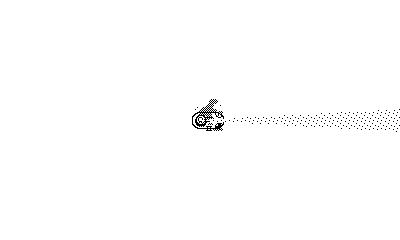

# Lighthouse

This is a PlayDate game developed during [PlayJam 5](https://itch.io/jam/playjam-5).

## Day One

Following the theme "You Forgot Something", I decided to create a game about a lighthouse that saves ships from perilous sea monsters and the cliff it stands on; *but things are not what they look like*. Below is the very first game draft:

By the end of the day, I had developed most of the game mechanics (sea monsters excluded) and optimized the code, because the game run at about 17 FPS on the device.

And (quite alarmingly) that was it.

## Day Two

I've added a simple storyline and sea monsters to improve the gameplay today. The game is using sprites now, but I had to remove the waves, as they were consuming too many resources on the real device. With these changes, Lighthouse is starting to feel like a real game.

## Day Three

Well, that were three insane days. Waves are gone: I have absolutely no time to add sprites with the same effect. The game receives its system menu, two game modes (but you need to pass the story mode first) and some sounds.

I managed to carve out a little time to work on some graphics, but Procreate isn't ideal for 1-bit graphics. The images turned out dirty and fuzzy, but that's what it is for now.

Anyway, I am glad I got this amazing opportunity to make a game for the console I admire so much. You can download it [here](https://fourbit.itch.io/lighthouse).